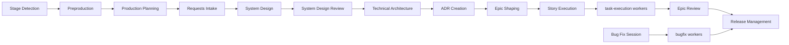

# AGDA Production Map

One-page routing guide for the AGDA production flow.

## High-Level Flow



## Stage Ownership

| Stage | What it does | Main files | Skill |
| --- | --- | --- | --- |
| Status Check | Finds the current project stage and the next executable item. | `production/status.md`, `production/backlog.md`, `production/epics/*.md` | `status-check` |
| Preproduction | Builds the game design baseline and approves the handoff. | `preproduction/*` | preproduction skills |
| Production Planning | Seeds epics only for work that needs 2+ stories. | `production/plan.md`, `production/backlog.md`, `production/status.md`, `production/epics/EPIC-###.md` | `production-planning` |
| Requests Intake | Classifies the request and creates or updates an epic only when the work needs 2+ stories. | `production/plan.md`, `production/backlog.md`, `production/status.md`, `production/epics/EPIC-###.md` | `requests-intake` |
| System Design | Designs the next unfinished epic before story/task shaping. | `production/plan.md`, `production/backlog.md`, `production/status.md`, `production/epics/EPIC-###.md`, `preproduction/systems.md`, `preproduction/architecture/technical.md` | `system-design` |
| Epic Shaping | Expands one epic into stories and tasks when the work needs 2+ stories. | `production/epics/EPIC-###.md`, `production/backlog.md`, `production/status.md` | `story-shaping` |
| Work Execution | Runs one shaped story and delegates task work. | `production/epics/EPIC-###.md`, `production/reviews/[STORY-ID]-review.md` | `work-execution` |
| Task Execution | Implements one task. Worker only. | task section in the epic doc | `task-execution` |
| Epic Review | Closes the epic, gathers feedback, routes follow-up work. | `production/reviews/[WORK-ID]-review.md`, `production/backlog.md`, `production/status.md` | `work-review` |
| Bug Fix Session | Coordinates one worker per standalone bug item. | `production/reviews/[BUG-ID]-review.md`, optional `production/bugs/[BUG-ID].md` | `bug-fix-session` |
| Bugfix Worker | Fixes one bug task. Worker only. | bug section in the epic doc | `bugfix` |
| Release Management | Packages completed work into a release. | `production/releases/vX.Y.Z.md` | `manage-release` |

## Routing Rules

1. Read `production/status.md` first.
2. If production has not started, finish preproduction and hand off to `production-planning`.
3. If the request needs intake, start with `requests-intake`.
4. If `production/backlog.md` contains an epic that needs 2+ stories, use `system-design` for the first unfinished epic.
5. If a standalone story has ready tasks, use `work-execution` as needed.
6. If a standalone task is ready, use `task-execution`.
7. If a bug is ready, use `bug-fix-session` or `bugfix`.
8. If no ready work remains and any epic is still open, use `system-design` for the next unfinished epic.
9. If no ready work remains and only standalone stories or tasks remain, use `work-execution` or `task-execution`.
10. If all epics are closed and no ready work remains, use `manage-release` or `requests-intake`.

## File Ownership

- `production/plan.md`: milestones and strategic order only.
- `production/backlog.md`: epic index only.
- `production/epics/EPIC-###.md`: epic summary, stories, tasks, acceptance, validation.
- `production/status.md`: one-screen routing snapshot.
- `production/reviews/*.md`: review evidence and closure.

## Quick Decision Tree

```text
Need to know where AGDA is?
-> status-check

Need to enter production from approved preproduction?
-> production-planning

Need to split an epic into stories and tasks?
-> story-shaping

Need to implement a story?
-> work-execution

Need to implement one task?
-> task-execution

Need to coordinate bugs?
-> bug-fix-session

Need to implement one bug?
-> bugfix
```

